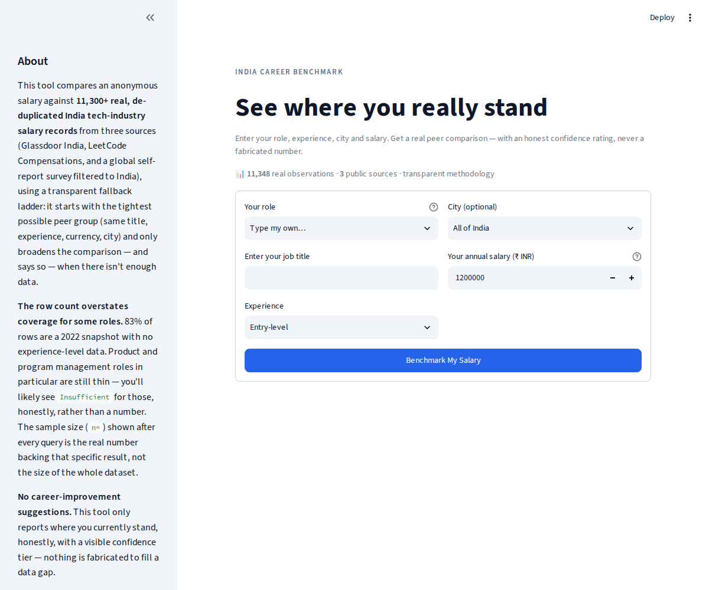
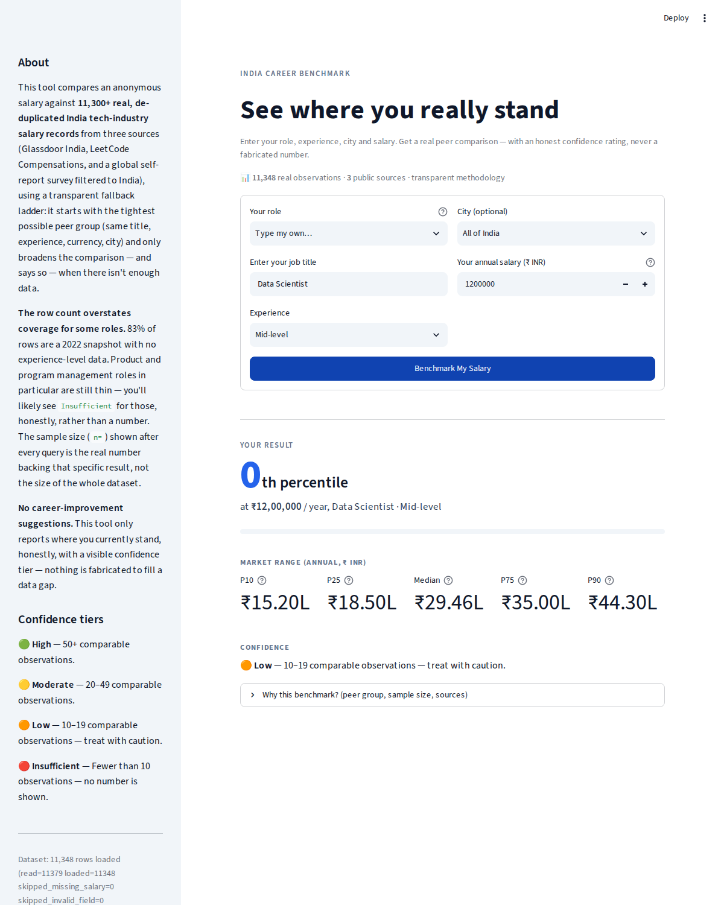

# India Professional Salary Benchmark

Anonymous input in ("this role, this experience, this salary, this city") →
a defensible peer comparison out ("here's where you sit, and how sure we
are"). Live as a one-click-deploy web app on top of the tested benchmark
engine below.

## Try it / deploy it

**Live demo:** *(add your deployed Streamlit Community Cloud URL here once
you've deployed — see steps below)*

| | |
|---|---|
|  |  |

### Deploy your own copy (Streamlit Community Cloud, free)

This repo's code is meant to be public (architecture, tests, methodology —
all inspectable), but the raw dataset is **not** — this repo's git history
never contains it. The app fetches it at runtime from a separate private
repo, via a read-only, single-repo-scoped token. See "Keeping the source
data private" below for exactly how; the short version:

1. **Set up the private data source first** (~10 minutes, one-time) — see
   the next section. You'll end up with a private GitHub repo holding the
   CSV, and a token.
2. Push **this** repo to your own GitHub account, as a **public** repo
   (`data/` is gitignored, so the CSV won't come along even if it's sitting
   on your disk).
3. Go to [share.streamlit.io](https://share.streamlit.io), sign in with
   GitHub, click **"New app"**, pick your repo, branch `main`, main file
   `app.py`.
4. Before (or right after) deploying, add the three secrets from the setup
   below under **Settings → Secrets** in the app dashboard.
5. Click **Deploy**. Anyone with the link can now enter their role,
   experience, salary, and city and get a real benchmark — without ever
   being able to see the underlying rows.

### Keeping the source data private

This repo's git history **never contains the raw CSV** — `data/` is
gitignored (see `.gitignore`). The app fetches the dataset at runtime from
a **separate private GitHub repo**, using a read-only, single-repo-scoped
token stored in Streamlit secrets (never in git). Everyone can use the
deployed app; nobody can see the underlying data by browsing this repo.

```
public repo (this one)          private repo (data only)
├── app.py  ────fetches at───▶  └── india_salaries_deduped.csv
│   (via data_loader.py,            (never appears in the public
│    using a scoped token)           repo's history, ever)
└── data/  (gitignored)
```

**One-time setup:**

1. **Create the private data repo.** On GitHub, create a new repo — private
   visibility — e.g. `india-salary-data-private`. Push just the CSV to it
   (a ready-to-push copy with a starter README is in this project's
   deliverable as `private-data-repo/`):
   ```bash
   cd private-data-repo
   git init
   git add .
   git commit -m "Initial dataset"
   git branch -M main
   git remote add origin https://github.com/<you>/india-salary-data-private.git
   git push -u origin main
   ```

2. **Create a fine-grained Personal Access Token**, scoped to *only* that
   repo:
   - GitHub → Settings → Developer settings → Personal access tokens →
     Fine-grained tokens → **Generate new token**.
   - Repository access: **Only select repositories** → pick
     `india-salary-data-private`.
   - Permissions: **Contents → Read-only**. Nothing else.
   - Set an expiration (90 days is a reasonable default — you'll rotate it).
   - Copy the token (`github_pat_…`) — you won't see it again.

3. **Push this app repo to GitHub as a public repo** (normal `git push`,
   no data in it).

4. **Add the secrets in Streamlit Community Cloud**, not in git: your app
   → ⋮ menu → **Settings → Secrets**, paste:
   ```toml
   github_token = "github_pat_..."
   data_repo = "<you>/india-salary-data-private"
   data_path = "india_salaries_deduped.csv"
   ```
   (`.streamlit/secrets.toml.example` in this repo documents the same three
   keys — copy it to `.streamlit/secrets.toml` for local development; that
   file is gitignored, so it's never committed.)

5. **Reboot the app** (Community Cloud does this automatically after you
   save secrets). It now pulls the CSV from the private repo at startup,
   using the token, and caches it in memory for the life of the deployment.

**Why a token instead of just a private main repo?** Streamlit Community
Cloud *can* deploy directly from a private repo, but the free tier allows
only **one** private-repo app (unlimited public ones) — and a fully private
repo also hides the engine, tests, and methodology, which is the part worth
keeping inspectable. Splitting code (public) from data (private, token-
gated) keeps both: anyone can read the architecture and verify the tests;
nobody can pull the raw rows.

**If the token leaks or expires:** it can only read that one repo's
contents, nothing else on your account — regenerate it and update the
Streamlit secret; no other action needed.

### Run it locally

```bash
git clone <your-fork-url>
cd benchmark_engine
pip install -r requirements.txt
```

Then either:
- Copy the CSV into `data/india_salaries_deduped.csv` (gitignored, stays
  local-only), **or**
- Copy `.streamlit/secrets.toml.example` to `.streamlit/secrets.toml` and
  fill in your own token/repo, to test the exact same path production uses.

```bash
streamlit run app.py
```

Then open the local URL Streamlit prints (usually `http://localhost:8501`).

### What the app does

`app.py` is a thin Streamlit form on top of `run_benchmark()` — it does not
change any engine module. It:
- lets the user pick a job title (from the 300 most common titles in the
  dataset, or type their own), experience level, city, and salary,
- calls the engine's existing fallback ladder and confidence logic exactly
  as-is,
- shows the confidence tier, cohort description (what was relaxed and why),
  the P10/P25/median/P75/P90 salary range, and the user's percentile —
  or, honestly, nothing numeric at all when the cohort is too small
  (`Insufficient` confidence), matching the engine's "never fabricate a
  result" design.

A user's salary is only ever used to compute their result within their own
browser session — nothing is written to disk or sent anywhere.


---

## The underlying engine — Phase 1 (complete, tested, running on real data, city-aware)

Anonymous input in ("this role, this experience, this salary, this city") →
a defensible peer comparison out ("here's where you sit, and how sure we
are"). No career-improvement suggestions yet — that's the deliberately
deferred next phase. This has gone through two passes:

1. Completed the engine that was partially uploaded (`schema.py` + the
   54-test suite) by writing the five missing modules the tests already
   specified, and built the real dataset those modules run against.
2. Added a city-aware cohort rung on top, fully backward-compatible with
   everything from pass 1.

## Files

```
app.py                  Streamlit web app: form + results UI on top of run_benchmark()             [new]
data_loader.py           Fetches the dataset from a private repo (or local file) - keeps the raw data out of this repo's git history [new]
requirements.txt        Python dependencies for the app                                             [new]
.streamlit/config.toml  App theme                                                                    [new]
.github/workflows/      CI: runs the 67-test suite on every push                                    [new]
schema.py              canonical SalaryObservation + currency segmentation + hardened loader   [from original upload, unchanged]
taxonomy.py             explicit, reviewable role-family groupings                               [new]
confidence.py           High/Moderate/Low/Insufficient thresholds (10/20/50)                      [new]
percentile_engine.py    empirical percentile bands + percentile-of-value, no modelling             [new]
cohort_engine.py        5-level fallback ladder for finding a defensible peer group                [new]
benchmark.py            orchestrator: query -> cohort -> confidence -> percentile -> provenance    [new]
demo_queries.py         6 real queries end-to-end against the real combined dataset                [new]
data/
  india_salaries_deduped.csv   deduplicated dataset, 3 sources (see data/README.md for full provenance)
  fetch_ai_jobs_net_survey.py  reproducible script for refreshing the 3rd source
demo_output_new.txt      captured output of demo_queries.py, run against real data
test_output_new.txt      captured output of the full 67-test suite (all passing)
test_*.py                the original uploaded 54-test suite, unmodified
test_cohort_engine_city.py   13 new tests for the city rung, kept in its own file on purpose
```

## What was built this pass

All five missing modules, written to satisfy the 54 tests that were
already there (nothing in the tests was changed to make them pass):

- **`taxonomy.py`** — explicit `title -> family` dict (no fuzzy/embedding
  matching), covering the role families actually present in the combined
  dataset (Software Engineering, Data Science, Mobile Development, DevOps/SRE,
  QA, Product/Project Management, Security, and others).
- **`confidence.py`** — `confidence_for(n)`, the four fixed thresholds from
  the README: `<10` Insufficient, `10–19` Low, `20–49` Moderate, `50+` High.
- **`percentile_engine.py`** — `compute_bands()` (P10/P25/P50/P75/P90, linear
  interpolation between order statistics — same method NumPy/Excel default
  to) and `percentile_of_value()` (midpoint-rule ranking so exact ties don't
  arbitrarily count as "above" or "below" everyone).
- **`cohort_engine.py`** — the 5-level fallback ladder exactly as specified:
  exact match → relax currency → broaden to role family → drop experience
  requirement → empty cohort, never a crash. Every level names what it
  relaxed in `CohortResult.description`.
- **`benchmark.py`** — `run_benchmark()`, the single entry point: builds the
  cohort, assigns a confidence tier, computes bands + the user's percentile
  *only* when confidence is above Insufficient (never a fabricated number
  from too little data), and returns full provenance (source counts, year
  range) plus any warnings (e.g. mixed-currency cohorts).

**All 54 originally-uploaded tests pass against this implementation, unmodified.**

## Pass 2: city-aware cohort matching

`cohort_engine.find_cohort()` and `benchmark.run_benchmark()` now take an
optional `city` parameter. This is additive, not a redesign:

- **Omit `city` (or pass `None`) and nothing changes** — same 5 levels,
  same numbering, same behaviour as pass 1. This is what keeps all 54
  original tests green untouched.
- **Pass `city`** and the ladder tries one extra, tighter rung *first*:
  exact title + exact experience + exact currency + **same city**. City is
  checked ahead of every other relaxation, on the theory that "people like
  me, near me" is the most locally useful comparison when the data
  actually supports it.
- If that tightest city-specific cohort is empty (city not recognized, no
  rows in that city for this role, or the source rows simply don't record
  a city), it falls back to the *entire* original ladder unfiltered by
  city — and every level number from there shifts up by exactly one, with
  the result's `description` explaining that the city-specific rung came
  up empty and why (e.g. `"(no Kochi-specific data — showing all of IN)"`).
  So `level=1` always means "as good as it gets, including your city";
  `level=2` when city was requested means "as good as it gets, country-wide,
  because your city didn't have enough."

New coverage for this: `test_cohort_engine_city.py`, 13 tests — 3 confirming
byte-for-byte backward compatibility when city is omitted/blank, 10 for the
new rung itself (case/whitespace-insensitive city matching, unknown city,
rows with no city recorded, and the shift-by-one behaviour at every existing
fallback level). Kept as a separate file rather than edited into the
original `test_cohort_engine.py`, so that file stays exactly what was
reviewed and agreed before.

`schema.py` gained one new optional field: `city: Optional[str] = None` on
`SalaryObservation`, and `load_observations()` reads a `city` column when
the source CSV has one. Both changes are backward compatible — the field
defaults to `None`, so every existing `SalaryObservation(...)` constructor
call in the original tests still works unmodified, and CSVs without a
`city` column (like the schema tests' own tiny fixture files) load exactly
as before.

## The data: bigger, richer, and now with real experience data across more of it

The original engine (per its README) ran against a 308-row dataset and
explicitly flagged "resume the search for a richer India-specific source"
as the next step. This pass does that: `data/india_salaries_deduped.csv`
combines **three** real India-specific sources —

- **Glassdoor India** salary reports (9,410 rows post-dedup) — the biggest
  source, but no years-of-experience field at all
- **LeetCode Compensations** forum posts (1,709 rows post-dedup) — smaller,
  but has real self-reported years of experience
- **`foorilla/ai-jobs-net-salaries`**, filtered to India residents (229 rows
  post-dedup) — a CC0-licensed, weekly-updated global self-report survey;
  added specifically to bring in real experience levels, a genuine
  INR/USD/EUR currency mix, fresher years (2020–2025), and — thinly, not
  solved — the first real "Product Manager" rows in this dataset

— **11,348 rows loaded, all INR- or foreign-currency-denominated,
all India-based.** See `data/README.md` for exact field-by-field
provenance, including the one derived field (`salary_in_usd`, via a cited
FRED/Federal Reserve exchange-rate series for the first two sources) and
which fields are honestly marked `UNK` rather than guessed.

**A word on composition, not just row count.** 83% of these rows are the
2022 Glassdoor snapshot, which has no experience-level field. So "11,348
rows" overstates how much data backs any specific experience-filtered
cohort — `data/README.md` has the honest per-source breakdown, and the app
always shows the real sample size (`n=`) and per-source counts for whatever
cohort it actually used, not the size of the whole dataset.

Run `python3 demo_queries.py` to see it working end-to-end — output is
captured in `demo_output_new.txt`, and it exercises all 5 fallback levels,
the city rung, and the mixed-currency warning on real rows (not synthetic
fixtures) — including a real "Product Manager" query, which now returns an
honest `Insufficient` from 2 real rows rather than a hard "no data" failure
with no fallback path at all.

## Design decisions carried forward from the original engine

- **Currency segmentation is non-negotiable.** INR-paid and USD-paid
  India-based workers are never blended into one cohort without an explicit
  warning (kept as-is; in this dataset every row happens to be INR, so the
  warning path is tested via the synthetic tests, not the demo).
- **Nothing is fabricated to fill a gap.** Missing salary → row skipped, not
  defaulted to 0. Cohort too small → `bands=None`, `user_percentile=None`,
  not a number computed from too little data. Missing experience/company
  size → `UNK`, not an assumed value.
- **`run_benchmark()` still takes `user_salary_in_usd` directly** — the
  currency-conversion step for raw INR user input still doesn't exist inside
  the engine itself (kept intentionally out, as before); it happens once,
  transparently, when building the *source* dataset, using a cited exchange
  rate — not silently inside the query path.

## Known limitations, still open

- City is now wired in as its own top rung, but it's still a single flat
  dimension — there's no "nearby city" concept (e.g. Gurugram falling back
  toward Delhi-NCR before dropping to all of India), and industry/sector
  still isn't a dimension at all.
- `data/india_salaries_deduped.csv` has real city values for the two
  original sources (~99% of those rows); the third source doesn't capture
  city at all, so those 229 rows always load with `city=None` and are
  honestly excluded from the city-specific rung rather than guessed.
- `taxonomy.py` is demo-scope — built from titles actually observed in this
  dataset, not exhaustive.
- **Product/Program-management coverage is still thin, not solved.** Adding
  `ai_jobs_net_survey` brought the exact-title "Product Manager" count from
  0 to 4 real rows (post-dedup) — real progress, but still below the
  `Insufficient` threshold of 10, so a "Product Manager" query correctly
  still returns no percentile in most cases. This needs another real
  India-specific PM-heavy source (see next steps), not a taxonomy tweak —
  the taxonomy already maps "product manager" to the right family, the
  underlying data just isn't there yet.
- The Streamlit UI (`app.py`) is a thin form, not a production API — no
  auth, rate limiting, or analytics, by design, since the tool is meant to
  be used anonymously.
- The dataset skews toward a 2022 snapshot (83% of rows are the 2022
  Glassdoor scrape). The third source adds real 2023–2025 rows, but a
  cohort that falls back to "any experience level" or "any currency" can
  still end up dominated by 2022 data — `year_range` is always shown in the
  provenance so this is visible, not hidden, but it isn't corrected for.

## Suggested next steps (in order)
1. Source another real, India-specific dataset with genuine Product/Program
   Management (and ideally Design, Business Analysis) coverage — LeetCode's
   forum and Glassdoor's 2022 scrape are both structurally engineering-heavy,
   so this needs a different kind of source, not more of the same two.
2. Design the career-improvement-suggestions layer (deferred by request —
   for now the tool only reports where someone stands, honestly, with a
   visible confidence tier).
3. Consider a "nearby city" grouping (e.g. NCR towns, Bengaluru metro) as an
   intermediate rung between exact-city and country-wide, if city-specific
   cohorts keep coming up thin.
4. ~~Wrap `run_benchmark()` in a minimal API + form so this can actually be
   tried by real anonymous users.~~ Done — see `app.py` and the "Deploy
   your own copy" instructions above.
